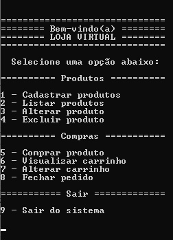

# SISTEMA DE LOJA VIRTUAL COM CRUD

Sistema desenvolvido em linguagem C que simula uma loja virtual, devido a seus variados recursos é recomendado o uso da IDE Codeblocks para sua execução plena

Em suas funcionalidades as 4 primeiras opções realizam a função de CRUD (create, read, update e delete). É possível cadastrar produtos, visualizá-los por meio de uma lista, alterar seus dados e excluí-los.

 
 
A segunda parte de opções diz respeito a compras, desde selecionar produtos, visualizar carrinho, alterar produtos no carrinho e fechar pedido. 

A cada pedido fechado o sistema é zerado e todo processo começa novamente.

Há espaço para mais validações e desenvolvimento dos processos, é um projeto que será aperfeiçoado.